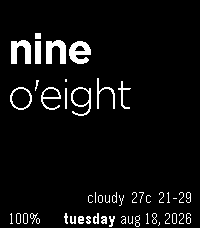
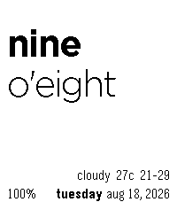

# Text Watch WDB Modern

A word-based Pebble watchface with weather, date, and battery status. Version 2
modernizes the original project for the current Pebble SDK and adds native
Pebble Time 2 support.

This fork has its own Pebble application UUID and package identity, so it can
be installed independently of the original Text Watch WDB. It is maintained by
Fangyang Shen and based on Justin Carvalho's weather-and-battery variant of the
original Pebble Text Watch.

The upstream repositories do not include an explicit software license. Their
code remains subject to the original authors' rights; the new UUID does not
change that status.

## Supported watches

- Pebble Time 2 (`emery`) at its full 200 x 228 resolution
- Pebble Classic / Steel (`aplite`)
- Pebble Time / Time Steel (`basalt`)
- Pebble 2 (`diorite`)
- Pebble 2 Duo (`flint`)

Round watches are intentionally not included yet; their layout needs a separate
circular design.

## Appearance

Open the watchface settings in the Pebble mobile app to choose one of two
high-contrast themes:

- White text on black
- Black text on white

The selected theme is saved on the watch.

| White on black | Black on white |
| --- | --- |
|  |  |

## Weather

Weather uses the phone's location through PebbleKit JS and the HTTPS
[Open-Meteo forecast API](https://open-meteo.com/). No API key is required.
Weather data is refreshed when the watchface starts and once per hour. The last
successful result is retained for up to six hours, and temporary failures retry
after 1, 5, and 15 minutes.

## Build

```sh
pebble build
```

Install on the Pebble Time 2 emulator:

```sh
pebble install --emulator emery
```
